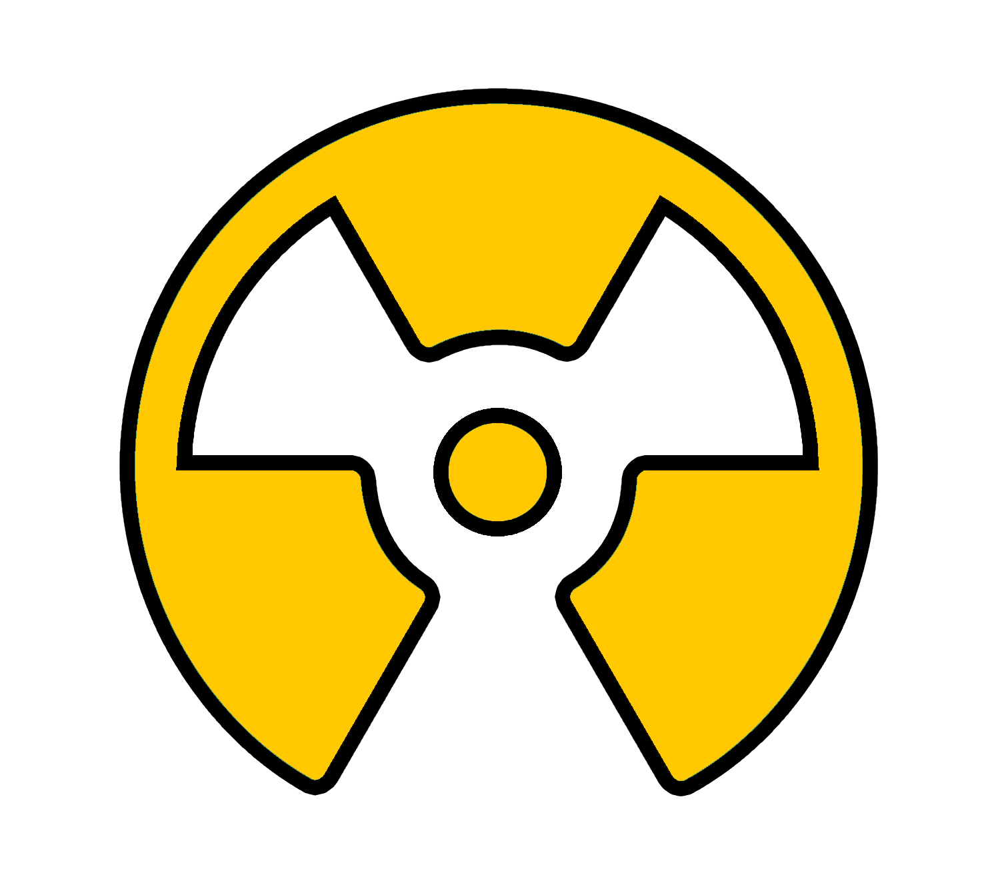
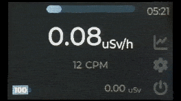

<a>
    
</a>

# OpenRad
Introducing OpenRad, a simple radiation monitoring solution powered by the SBM-20 GM tube and TTGO ESP32 microcontroller. this project offers a user-friendly approach to tracking and measuring radiation levels.

# Table of Contents
- [Demo](#demo)
- [Install](#install)
- [Folder Structure](#folder-structure)
- [FAQS](#faqs)
- [License](#license)

# Demo

### Youtube Demo
[](https://www.youtube.com/watch?v=ACgCJScDpeg)

# Install
1. Install [VSCode](https://code.visualstudio.com/).
2. Install [PlatformIO](https://platformio.org/).
3. Clone this repository 
```bash
git clone https://github.com/omarkhorshid/OpenRad.git
```
4. (optional) Install [Squareline Studio](https://squareline.io/).
5. (optional) For Squareline, Change the project settings save paths to match your project directory.
6. In PlatformIO extension: Platform > Upload the Filesystem Image.
7. In PlatformIO extension: General > Upload the code to the TTGO board.

# Dependencies
- [lvgl v8.3.11](https://github.com/lvgl/lvgl/tree/release/v8.3)
- [TFT_eSPI v2.4.61](https://github.com/Bodmer/TFT_eSPI)
- [AsyncTCP-esphome v1.2.2](https://github.com/esphome/AsyncTCP.git)
- [ESPAsyncWebServer-esphome v2.1.0](https://github.com/esphome/ESPAsyncWebServer.git)
- [PubSubClient v2.8](https://github.com/knolleary/pubsubclient.git)
- [ArduinoJson v7.0.4](https://github.com/bblanchon/ArduinoJson.git)

# Folder Structure
### Software/Firmware/src
- `hardware.cpp/h` : Contains hardware init and functions. 
- `settings.cpp/h` : Contains the settings.
- `geiger.cpp/h` : Contains geiger calculations.
- `gui.cpp/h` : Contains LVGL functions.
- `connectivity.cpp/h` : Contains all the connectivity functions.

### Software/Firmware/lib/ui/src
- `ui_events.c/h` : Contains the UI events.

### Software/Firmware/data
- `index.html` : Contains the web interface.
- `chart.js` : Chart.js Library file.

# FAQs
### How do I Navigate the UI in OpenRad?
Using the three buttons, up down and enter. ...

### How do I change the measuring window?
After uploading the code to the ESP, open the settings cogwheel, and change the settings you want.

### How do I turn OpenRad off?
- For **Sleep mode**: Navigate to the power button and click it.
- For **Deep Sleep mode**: Hold the button untill this message pops up, then release it before it disappears.

### What types of connectivity does OpenRad have?
OpenRad has WiFi and MQTT connectivity to be able to remotely monitor the radiation levels from the Web interface.

###How do I connect to OpenRad?
To connect to OpenRad and access the web interface


# License
OpenRad is [BSD-3 Licensed](license.txt '3-Clause BSD License')
